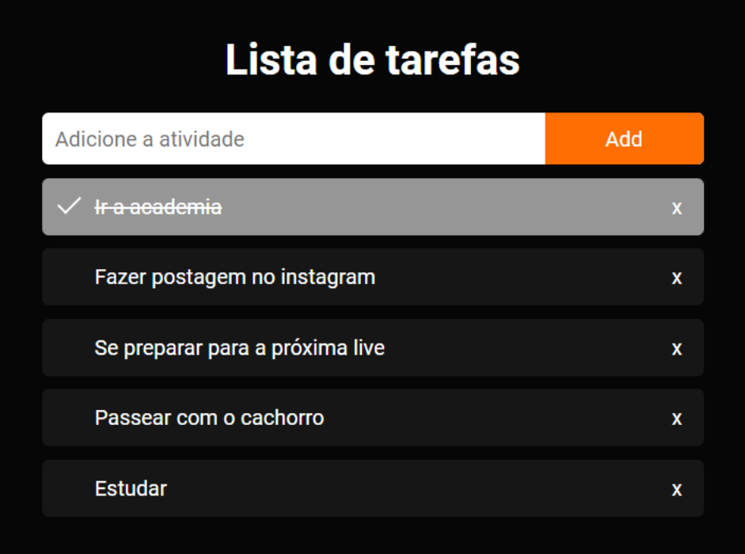

# Todo list com HTML, CSS e Javascript

> Este projeto foi criado durante as aulas que faço online e de graça, toda quinta a noite, às 20h. 
> Para se cadastrar e ser notificado das aulas você pode acessar [este link](https://jornadaweb.com/).

Este todo list criado somente com HTML, CSS e Javascript é ótimo tanto para você utilizar no seu dia a dia para acompanhar o progreço das suas atividades quanto para você praticar desenvolvimento web. Todo lists são ótimos pontos de partida para aprender qualquer tecnologia. Com ele é possível praticar o famosos CRUD (criar, ler, atualizar e deletar), o que fazemos utilizando javascritp, e a visualização de tudo isso ocorrendo na tela, que fizemos utilizando o HTML e CSS.

- Aula #2: Criação do HTML e CSS do nosso Todo - [link](https://www.youtube.com/watch?v=VeZ4H9qiW6o)
- Aula #3: Criação Javascripr do nosso Todo - [link](https://www.youtube.com/watch?v=MmLvHQTKDj0&t=2756s)